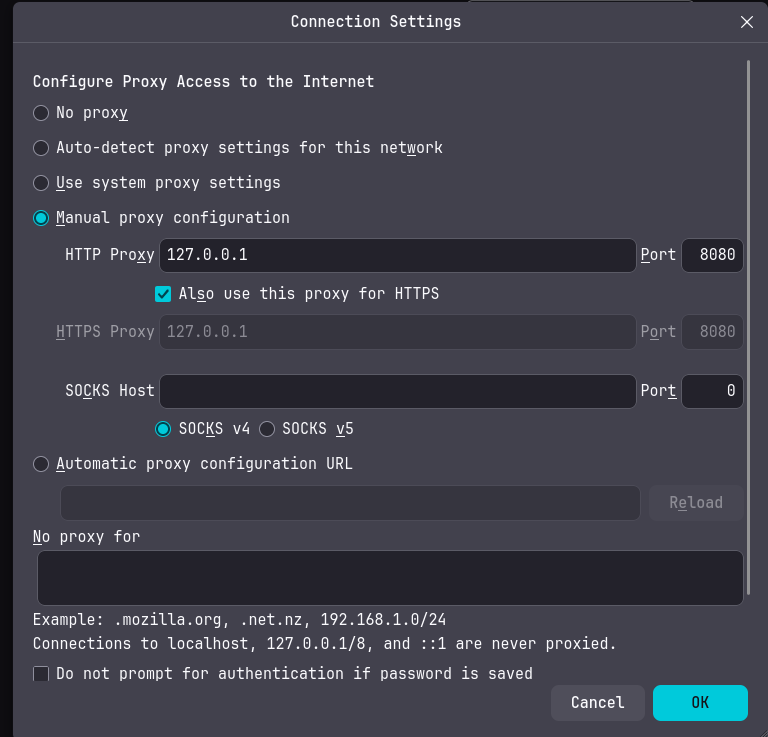
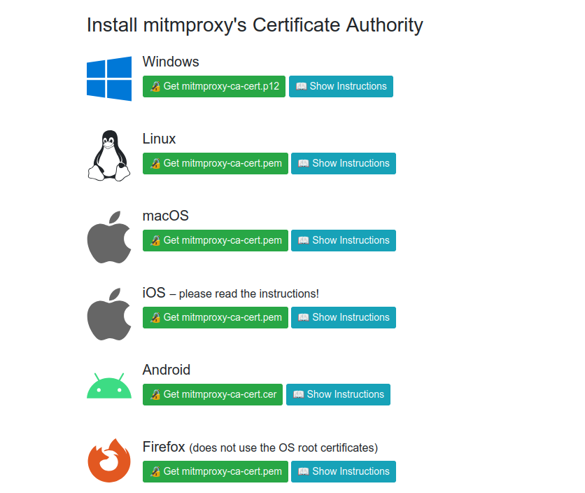
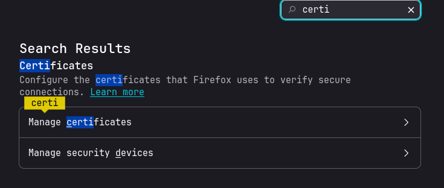
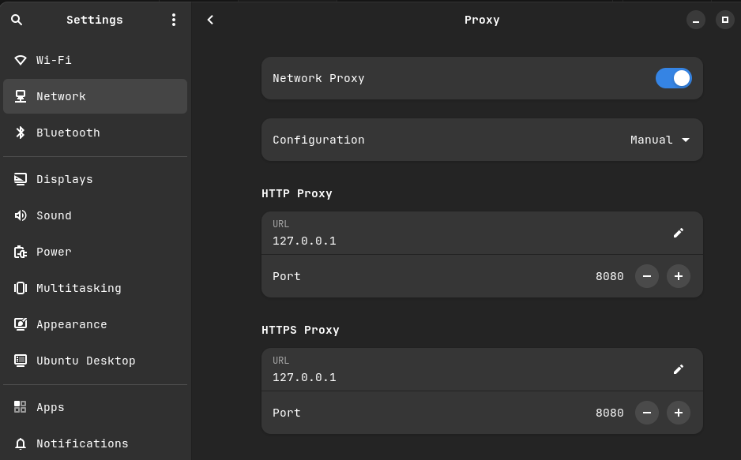

# Proxy 🧑‍💻

---
### Resumo e objetivo 

- Com a proxy própria adicionada ao navegador (firefox) podemos ter acesso ao
tráfego http assim podendo auxiliando a detectar comportamentos estranhos.

## Como isso foi feito?    

---
- Biblioteca **python mitmproxy**: intercepta conexões(http, htttps) , elas passam 
por `127.0.0.1:8080`

- **Configuração** (settings) no navegador firefox: 
	- proxy (configurada como manual): porta 8080

- **Compatibilidade certificado**: 
	- Se deve instalar o certificado na url `http://mitm.it/`
	- Instalar e atualizar as certificações do sistema
	- Adicionar certificação na configurações avançadas do firefox:
		- Pesquisar certificados e adicionar o certificado para o mitmproxy

- Pronto! Agora todo tráfego passa antes pelo o `mitmproxy`. Com isso foi criado o
software monitoramento. Que a IA batizou de **`sentinela`**

### Adendo
- no unbunto você pode colcoar sua própria proxy como default, assim todos os navegadores
usaram a proxy, você deve adicionar o certificado para cada uma delas.
